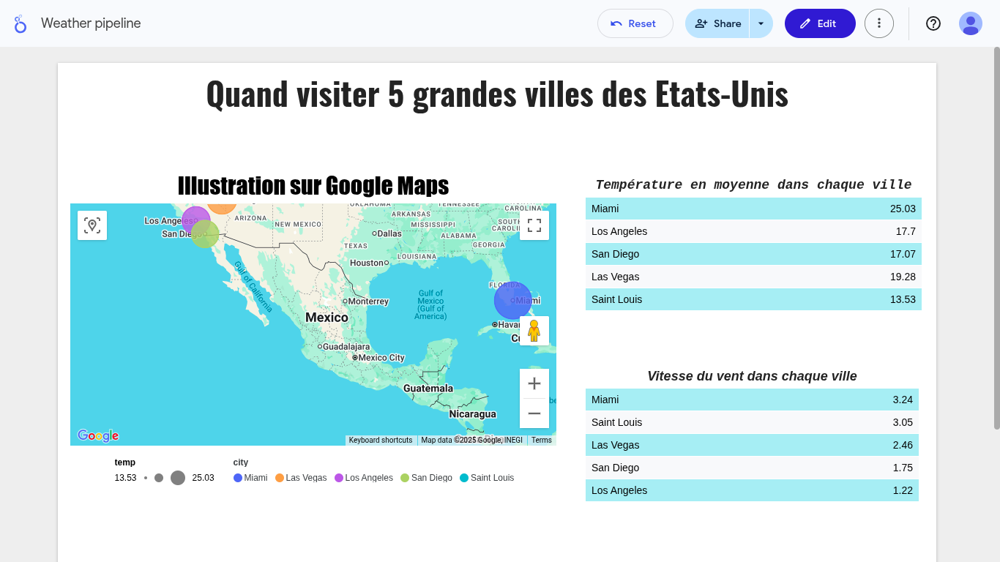

# Weather ETL pipeline for Holiday
 This BI project was built for you to know the best period of the year to go on holiday in 5 USA cities :
- Las Vegas
- Miami
- Saint Louis
- Los Angeles
- San Diego

Here is the main page of the dashboard :

In the Google Map feature of th dashboard, the bigger the circle is, the hotter the city is. But, not only is the temperature important but also, we need to consider other factors such as **wind speed**,**humidity of the air**, and **the pressure**. (not yet finished)

[Looker Studio](https://lookerstudio.google.com) was used to create this dashboard where we you can filter the results between two months. [Google Sheet](https://docs.google.com/spreadsheets) was the tool used to merge data online.

The data from this dashboard was merged from historical data taken from [Kaggle](https://www.kaggle.com), and [Open Weather API](https://openweathermap.org) for current weather.

[Python](https://www.python.org) is the language used to write the scripts. To sum up the steps to build the project. First, here is the structure of the project :

- `WEATHER_PIPELINE/`
  - `config/`
  - `dags/`
    - `data/`
      - `cleaned_historical_data/`
      - `historical_data/`
      - `combined_data.csv`
      - `current_data.csv`
      - `extracted_historical.csv`
    - `scripts/`
      - `clean_data.py`
      - `combine_historical_weather.py`
      - `extract_current.py`
      - `extract_historical.py`
      - `save_data.py`
    - `weather_etl_dag.py`
  
The raw data from Kaggle were merged into one file with "_script/combine_historical_weather.py_" in "_**data/cleaned_historical_data/historical_weather.csv**_"

The historical data from "_**data/cleaned_historical_data/historical_weather.csv**_" were tranformed and cleaned with "_scripts/extract_historical.py_" and loaded in "_**data/extracted_historical.csv**_"

The current weather from Open Weather API with _"scripts/extract_current.py"_ is loaded in "_**data/current_data.csv**_"

The historical and current is merged with "_scripts/clean_data.py_"  into "_**data/combined_data.csv**_" and loaded online in Google Sheet with "_scripts/save_data.csv_"

[Apache Airflow](https://airflow.apache.org) is the tool used to automate the python scripts instead of running everything manually.

You can install Apache Airflow in your local machine and run :
>apache scheduler & apache api-server & apache dag-processor

You can launch it in 3 differents terminals or into one.